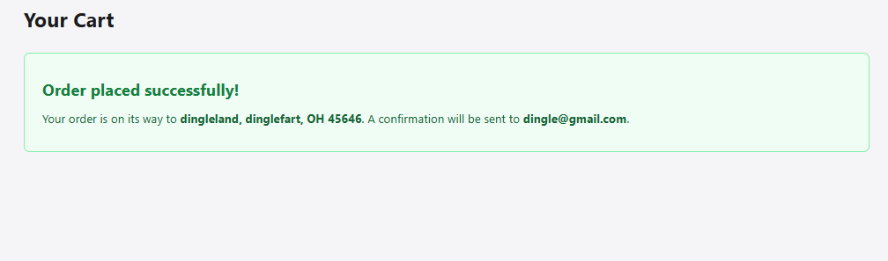

# AI Usage Log — M4: Shopping Cart

## Session: Week 8 Lab (March 6, 2026)

### AGENTS.md Setup
- **What:** Created AGENTS.md with project conventions
- **Result:** AI-generated components used correct import paths and CSS Modules

### Cart Reducer + Types (Part 2)
- **Generated by:** [Claude/Copilot]
- **Review issues found:** There was none for this phase. The only thing I had to do was make .net run in 8.0 instead of 10.0, since I'm running on 8.0. 
- **Monday concepts verified:** [Discriminated unions, pure reducer, immutable updates]

### Cart Context (Part 3)
- **Generated by:** [Claude/Copilot]
- **Modifications I made:** I had to modify the code a little bit to get React Devtools on the frontend to say "CarProvider" at the time and have it wrap around everything. 

### Cart Components (Part 4)
- **Generated by:** [Claude/Copilot]
- **Issues in AI output:** Nothing went wrong here, more user error since I thought the beginning portion of this section is when it generates the cart icon for the frontend, but that wasn't till 4.2. The only big issue was the cart had to be located by doing localhost:####/product/cart...etc (something like that), but I wanted it to be a bottom, so you didn't need to do all that. I gave the agent a similar prompt and it fixed/added that for me.

### Checkout Form (Part 5)
- **Generated by:** [Claude/Copilot]
- **Wednesday concepts verified:** [Controlled components, onBlur validation, touched tracking, submission handling]
- **Issues found:** Similar to Cart Components (Part 4), it started off something like localhost:####/api/products/checkoutform, but I wanted it to sync with each other. So, I made sure when you do click the cart and add or remove items, it display all that information below it so you can see all of it at once. I also had to edit the "Processing...", as it wasn't giving a "Success, will be shipping to this address ####...etc", so, with the agent, I added a screen BEFORE you go back to the home page basically taking the information you filled out and saying "Success, it'll be shipped to here ...etc". It all runs smooth, like how a normal ecommernce website would (like Amazon).

Picture of checkout form: 